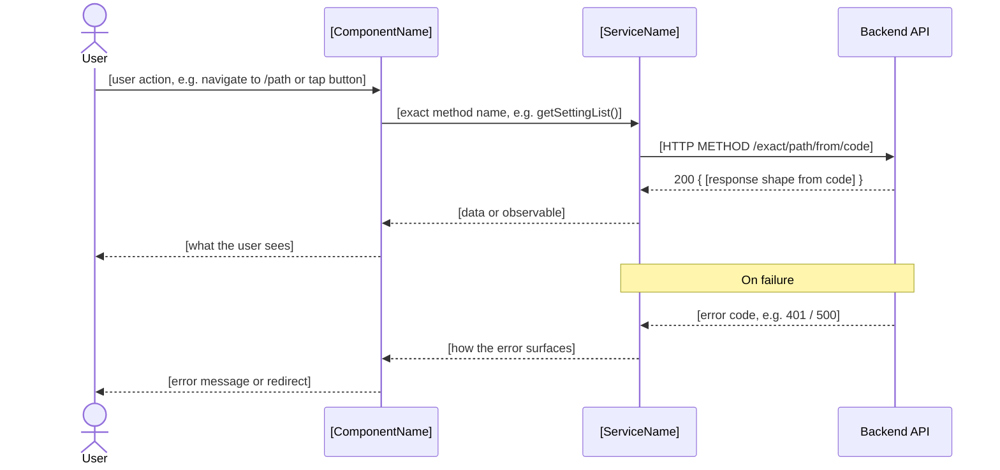
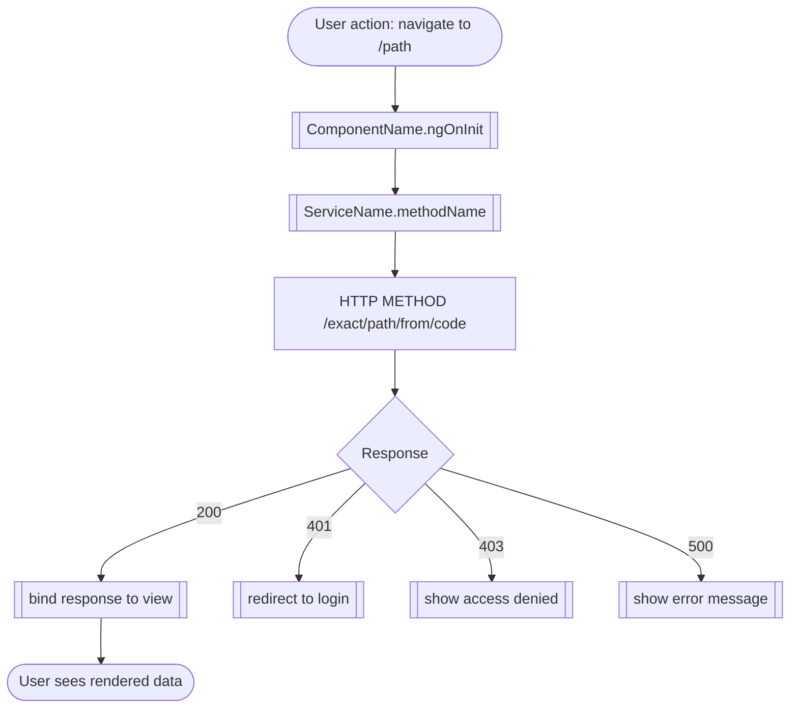
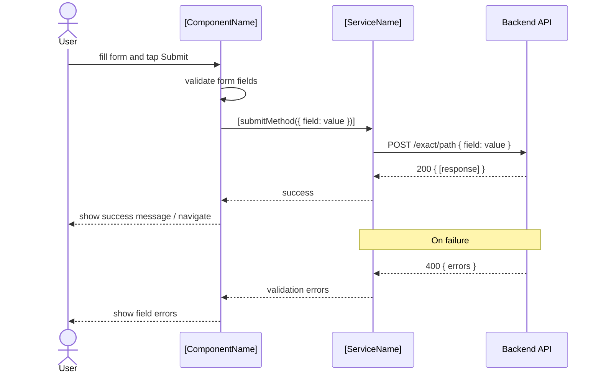
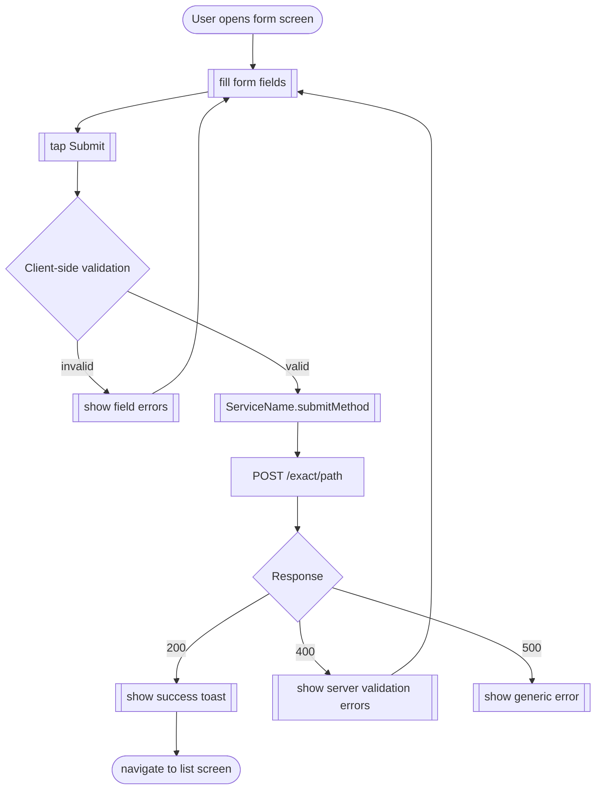

# Functional Flow Document (FFL) Generator

## CONTRACT — read this first

This task has exactly one completion condition: the file `FFL-[ProjectName]-[YYYY-MM-DD].md` must exist on disk, written using the **Write tool**.

**ALL output — including the final document — must be written using tool calls (Write/Edit). Never print file content as a chat message.**

Until that file is written using the Write tool:
- Do NOT produce any text response to the user.
- Do NOT summarize findings in text.
- Do NOT print the FFL document content as a message — use the Write tool instead.
- Do NOT ask the user anything.
- Do NOT stop between steps.
- Write intermediate findings to `ffl-scratch.md` using the Write/Edit tool (a tool call, not text).
- Always use FULL paths when reading files — never bare filenames.

The only acceptable output is tool calls, until `FFL-[ProjectName]-[YYYY-MM-DD].md` is written to disk.

---

## Step 0 — Detect OS and Shell

**Run:**
```
node -e "console.log(process.platform)"
```

- `darwin` / `linux` → **Unix**: write `OS=unix SHELL=bash` to `ffl-scratch.md`. Use **bash** commands in every step below.
- `win32` → **Windows**: run the following to detect the shell:
  ```
  node -e "console.log(process.env.PSModulePath ? 'powershell' : 'cmd')"
  ```
  - Result `powershell` → write `OS=win32 SHELL=powershell` to `ffl-scratch.md`. Use **PowerShell** commands.
  - Result `cmd` → write `OS=win32 SHELL=cmd` to `ffl-scratch.md`. Use **CMD** commands.

Go to Step 1.

---

## Step 1 — List project root

**bash:** `ls`
**PowerShell:** `Get-ChildItem -Name`
**CMD:** `dir /b`

Append to `ffl-scratch.md` under `# Detection`. Go to Step 2.

---

## Step 2 — Detect platforms

**bash:**
```
find . -maxdepth 4 -name "angular.json" -o -name "AndroidManifest.xml" -o -name "*.xcodeproj"
```
**PowerShell:**
```
Get-ChildItem -Recurse -Depth 4 -Include "angular.json","AndroidManifest.xml","*.xcodeproj" -ErrorAction SilentlyContinue | Select-Object -ExpandProperty FullName | Select-Object -First 10
```
**CMD:**
```
dir /s /b angular.json 2>nul & dir /s /b AndroidManifest.xml 2>nul & dir /s /b *.xcodeproj 2>nul
```

Append to `ffl-scratch.md`. Go to Step 3.

---

## Step 3 — Detect Spring Boot

**bash:**
```
find . -maxdepth 5 -name "Application.kt" -o -name "Application.java"
```
**PowerShell:**
```
Get-ChildItem -Recurse -Depth 5 -Include "Application.kt","Application.java" -ErrorAction SilentlyContinue | Select-Object -ExpandProperty FullName | Select-Object -First 5
```
**CMD:**
```
dir /s /b Application.kt Application.java 2>nul
```

Append to `ffl-scratch.md`. Note which platforms are present. Go to Step 4.

---

## Step 4 — Architecture

Run every block whose platform was detected. Limit output to 30 lines. Append to `ffl-scratch.md` under `# Architecture`. Run all that apply, then go to Step 5.

### Angular

**bash:**
```
find src/app -maxdepth 2 -type d | head -30
```
**PowerShell:**
```
Get-ChildItem -Path src/app -Depth 2 -Directory -ErrorAction SilentlyContinue | Select-Object -ExpandProperty FullName | Select-Object -First 30
```
**CMD:**
```
dir /s /b /ad src\app 2>nul
```

**bash:**
```
find src -name "*.service.ts" | head -30
```
**PowerShell:**
```
Get-ChildItem -Path src -Recurse -Filter "*.service.ts" -ErrorAction SilentlyContinue | Select-Object -ExpandProperty FullName | Select-Object -First 30
```
**CMD:**
```
dir /s /b src\*.service.ts 2>nul
```

**bash:**
```
grep -rl "StoreModule\|createReducer\|BehaviorSubject\|signal" src --include="*.ts" | head -10
```
**PowerShell:**
```
Get-ChildItem -Path src -Recurse -Include "*.ts" -ErrorAction SilentlyContinue | Select-String -Pattern "StoreModule|createReducer|BehaviorSubject|signal" -List | Select-Object -ExpandProperty Path | Select-Object -First 10
```
**CMD:**
```
findstr /s /m /c:"StoreModule" /c:"createReducer" /c:"BehaviorSubject" /c:"signal" src\*.ts 2>nul
```

### Spring Boot

**bash:**
```
find src/main -name "*Controller*" -o -name "*UseCase*" -o -name "*Repository*" -o -name "*Service*" | head -30
```
**PowerShell:**
```
Get-ChildItem -Path src/main -Recurse -Include "*Controller*","*UseCase*","*Repository*","*Service*" -ErrorAction SilentlyContinue | Select-Object -ExpandProperty FullName | Select-Object -First 30
```
**CMD:**
```
dir /s /b src\main\ 2>nul | findstr /i "Controller UseCase Repository Service"
```

**bash:**
```
cat settings.gradle.kts 2>/dev/null || cat settings.gradle 2>/dev/null
```
**PowerShell:**
```
Get-Content settings.gradle.kts -ErrorAction SilentlyContinue -TotalCount 30
```
**CMD:**
```
type settings.gradle.kts 2>nul
```
If that returns nothing:
```
type settings.gradle 2>nul
```

### Android

**bash:**
```
find app/src/main -type d | head -20
```
**PowerShell:**
```
Get-ChildItem -Path app/src/main -Recurse -Directory -ErrorAction SilentlyContinue | Select-Object -ExpandProperty FullName | Select-Object -First 20
```
**CMD:**
```
dir /s /b /ad app\src\main 2>nul
```

**bash:**
```
grep -rl "HiltViewModel\|@Inject\|@Module" app/src --include="*.kt" | head -10
```
**PowerShell:**
```
Get-ChildItem -Path app/src -Recurse -Include "*.kt" -ErrorAction SilentlyContinue | Select-String -Pattern "HiltViewModel|@Inject|@Module" -List | Select-Object -ExpandProperty Path | Select-Object -First 10
```
**CMD:**
```
findstr /s /m /c:"HiltViewModel" /c:"@Inject" /c:"@Module" app\src\*.kt 2>nul
```

**bash:**
```
grep -rl "@Composable\|setContent" app/src --include="*.kt" | head -10
```
**PowerShell:**
```
Get-ChildItem -Path app/src -Recurse -Include "*.kt" -ErrorAction SilentlyContinue | Select-String -Pattern "@Composable|setContent" -List | Select-Object -ExpandProperty Path | Select-Object -First 10
```
**CMD:**
```
findstr /s /m /c:"@Composable" /c:"setContent" app\src\*.kt 2>nul
```

### iOS

> iOS development requires macOS. If running on Windows, skip this section entirely.

**bash:**
```
find . -maxdepth 4 -type d -not -path "*/.git/*" -not -path "*/Pods/*" | head -30
```
**PowerShell:**
```
Get-ChildItem -Depth 4 -Directory -ErrorAction SilentlyContinue | Where-Object { $_.FullName -notmatch "\.git|Pods" } | Select-Object -ExpandProperty FullName | Select-Object -First 30
```

**bash:**
```
grep -rl "@Observable\|ObservableObject\|ViewModel" . --include="*.swift" | head -10
```
**PowerShell:**
```
Get-ChildItem -Recurse -Include "*.swift" -ErrorAction SilentlyContinue | Select-String -Pattern "@Observable|ObservableObject|ViewModel" -List | Select-Object -ExpandProperty Path | Select-Object -First 10
```

---

## Step 5 — Read routing / navigation files in full

Find routing files and READ EACH ONE IN FULL. This is mandatory — do not skip. Append all content to `ffl-scratch.md` under `# Routes`.

### Angular

**bash:**
```
find src -name "*.routes.ts" -o -name "*-routing.module.ts" -o -name "app.routes.ts" | head -10
```
**PowerShell:**
```
Get-ChildItem -Path src -Recurse -Include "*.routes.ts","*-routing.module.ts","app.routes.ts" -ErrorAction SilentlyContinue | Select-Object -ExpandProperty FullName | Select-Object -First 10
```
**CMD:**
```
dir /s /b src\*.routes.ts src\*-routing.module.ts 2>nul
```

Read every file returned. Extract from each file: route paths, component names, canActivate guards, resolve resolvers, loadChildren or loadComponent targets.

### Spring Boot

**bash:**
```
grep -rn "@GetMapping\|@PostMapping\|@PutMapping\|@DeleteMapping\|@PatchMapping\|@RequestMapping" src/main --include="*.java" --include="*.kt" -l | head -15
```
**PowerShell:**
```
Get-ChildItem -Path src/main -Recurse -Include "*.java","*.kt" -ErrorAction SilentlyContinue | Select-String -Pattern "@GetMapping|@PostMapping|@PutMapping|@DeleteMapping|@PatchMapping|@RequestMapping" -List | Select-Object -ExpandProperty Path | Select-Object -First 15
```
**CMD:**
```
findstr /s /m /c:"@GetMapping" /c:"@PostMapping" /c:"@PutMapping" /c:"@DeleteMapping" /c:"@PatchMapping" /c:"@RequestMapping" src\main\*.java 2>nul
findstr /s /m /c:"@GetMapping" /c:"@PostMapping" /c:"@PutMapping" /c:"@DeleteMapping" /c:"@PatchMapping" /c:"@RequestMapping" src\main\*.kt 2>nul
```

Read every controller file returned. Extract from each file: class-level `@RequestMapping`, method-level mappings, `@PathVariable`, `@RequestParam`, `@RequestBody` type, return type.

### Android

**bash:**
```
find app/src -name "nav_graph*.xml" -o -name "navigation*.xml" | head -5
```
**PowerShell:**
```
Get-ChildItem -Path app/src -Recurse -Include "nav_graph*.xml","navigation*.xml" -ErrorAction SilentlyContinue | Select-Object -ExpandProperty FullName | Select-Object -First 5
```
**CMD:**
```
dir /s /b app\src\nav_graph*.xml app\src\navigation*.xml 2>nul
```

Read every nav graph file returned.

**bash:**
```
grep -rn "NavHost\|composable(\|navigate(" app/src --include="*.kt" | head -30
```
**PowerShell:**
```
Get-ChildItem -Path app/src -Recurse -Include "*.kt" -ErrorAction SilentlyContinue | Select-String -Pattern "NavHost|composable\(|navigate\(" | Select-Object Path, LineNumber, Line | Select-Object -First 30
```
**CMD:**
```
findstr /s /n /c:"NavHost" /c:"composable(" /c:"navigate(" app\src\*.kt 2>nul
```

### iOS

> iOS development requires macOS. If running on Windows, skip this section entirely.

**bash:**
```
grep -rn "NavigationStack\|NavigationLink\|\.sheet(\|\.fullScreenCover(" . --include="*.swift" | head -30
```
**PowerShell:**
```
Get-ChildItem -Recurse -Include "*.swift" -ErrorAction SilentlyContinue | Select-String -Pattern "NavigationStack|NavigationLink|\.sheet\(|\.fullScreenCover\(" | Select-Object Path, LineNumber, Line | Select-Object -First 30
```

After reading all routing files, go to Step 6.

---

## Step 6 — Read service / API files in full

This step is MANDATORY. Read the actual source files to extract real endpoint URLs and method names. Do not guess or infer — only write what you read.

### Angular — read environment file (REQUIRED)

Read this file in full — this gives the real base URL:

**bash:**
```
cat src/environments/environment.ts
```
**PowerShell:**
```
Get-Content src/environments/environment.ts -ErrorAction SilentlyContinue
```
**CMD:**
```
type src\environments\environment.ts 2>nul
```

If that returns nothing, try:

**bash:**
```
find src -name "environment*.ts" | head -5
```
**PowerShell:**
```
Get-ChildItem -Path src -Recurse -Include "environment*.ts" -ErrorAction SilentlyContinue | Select-Object -ExpandProperty FullName | Select-Object -First 5
```
**CMD:**
```
dir /s /b src\environment*.ts 2>nul
```

Read every environment file found. Append the base URL to `ffl-scratch.md` under `# BaseURL`.

### Angular — read all service files that make HTTP calls

**bash:**
```
grep -rl "this\.http\." src --include="*.ts" | head -20
```
**PowerShell:**
```
Get-ChildItem -Path src -Recurse -Include "*.ts" -ErrorAction SilentlyContinue | Select-String -Pattern "this\.http\." -List | Select-Object -ExpandProperty Path | Select-Object -First 20
```
**CMD:**
```
findstr /s /m /c:"this.http." src\*.ts 2>nul
```

Read EVERY file returned. For each file, extract:
- The service class name
- Every method that calls `this.http.get/post/put/delete/patch`
- The exact URL string or template literal passed to each call
- The request body type if any

Append all findings to `ffl-scratch.md` under `# ServiceMethods`.

### Spring Boot — read all controller files

Read each controller file found in Step 5 in full. For each file extract the exact endpoint paths and types.

### Android — read Retrofit interface files

**bash:**
```
grep -rl "@GET\|@POST\|@PUT\|@DELETE\|@PATCH" app/src --include="*.kt" | head -15
```
**PowerShell:**
```
Get-ChildItem -Path app/src -Recurse -Include "*.kt" -ErrorAction SilentlyContinue | Select-String -Pattern "@GET|@POST|@PUT|@DELETE|@PATCH" -List | Select-Object -ExpandProperty Path | Select-Object -First 15
```
**CMD:**
```
findstr /s /m /c:"@GET" /c:"@POST" /c:"@PUT" /c:"@DELETE" /c:"@PATCH" app\src\*.kt 2>nul
```

Read every file returned. Extract each annotated method: HTTP method, path, `@Body`, `@Path`, `@Query` parameters, return type.

Also find and read the Retrofit base URL config:

**bash:**
```
grep -rn "BASE_URL\|baseUrl\|Retrofit\.Builder\|HttpLoggingInterceptor" app/src --include="*.kt" | head -10
```
**PowerShell:**
```
Get-ChildItem -Path app/src -Recurse -Include "*.kt" -ErrorAction SilentlyContinue | Select-String -Pattern "BASE_URL|baseUrl|Retrofit\.Builder" | Select-Object Path, LineNumber, Line | Select-Object -First 10
```
**CMD:**
```
findstr /s /n /c:"BASE_URL" /c:"baseUrl" /c:"Retrofit.Builder" app\src\*.kt 2>nul
```

### iOS — read network files

> iOS development requires macOS. If running on Windows, skip this section entirely.

**bash:**
```
find . -name "*API*.swift" -o -name "*Service*.swift" -o -name "*Network*.swift" | grep -v "Test\|Mock" | head -10
```
**PowerShell:**
```
Get-ChildItem -Recurse -Include "*API*.swift","*Service*.swift","*Network*.swift" -ErrorAction SilentlyContinue | Where-Object { $_.Name -notmatch "Test|Mock" } | Select-Object -ExpandProperty FullName | Select-Object -First 10
```

Read every file returned. Extract endpoint paths and HTTP methods.

After reading all service files, go to Step 7.

---

## Step 7 — Version info

**bash:**
```
head -20 package.json 2>/dev/null
```
**PowerShell:**
```
Get-Content package.json -ErrorAction SilentlyContinue -TotalCount 20
```
**CMD:**
```
type package.json 2>nul
```

**bash:**
```
head -20 build.gradle.kts 2>/dev/null
```
**PowerShell:**
```
Get-Content build.gradle.kts -ErrorAction SilentlyContinue -TotalCount 20
```
**CMD:**
```
type build.gradle.kts 2>nul
```

**bash:**
```
head -20 pom.xml 2>/dev/null
```
**PowerShell:**
```
Get-Content pom.xml -ErrorAction SilentlyContinue -TotalCount 20
```
**CMD:**
```
type pom.xml 2>nul
```

Append version and project name to `ffl-scratch.md` under `# Meta`. Go to Step 8.

---

## Step 8 — Write the FFL document

**MANDATORY: Use the Write tool to write the file to disk. Do NOT print the document content as a chat message.**

1. Read `ffl-scratch.md` in full using the Read tool.
2. Call the **Write tool** with `file_path = FFL-[ProjectName]-[YYYY-MM-DD].md` and the full document as `content`. This is NOT optional — the document MUST be a file on disk, not text in chat.
3. After the Write tool confirms success, delete `ffl-scratch.md` using the shell that was detected in Step 0:
   - **bash / PowerShell:** `rm ffl-scratch.md`
   - **CMD:** `del ffl-scratch.md`
4. Only after the file exists on disk, post a single short message: `FFL written to FFL-[ProjectName]-[YYYY-MM-DD].md`

Use ONLY information read from actual files. If an endpoint URL or base URL was not found in any file, write `[undocumented]` — do not guess or use placeholder values like `https://api.example.com`.

---

## Output structure

```markdown
# Functional Flow Document — [Project Name]

**Version:** [from package.json / build.gradle / pom.xml]
**Generated:** [today's date]
**Platforms:** [detected platforms]

---

## 1. Architecture Overview

### 1.1 System Architecture
[One paragraph: how platforms connect and communicate]

### 1.2 [Platform] Architecture
**Pattern:** [MVVM / Clean Architecture / MVC / etc.]
**Layers:**
- `[layer]` — [responsibility]

**Key Directories:**
| Directory | Purpose |
|-----------|---------|
| `path/to/dir` | [what lives here] |

---

## 2. Functional Flows

> Each flow traces the full path from user action → component → service method → API call → response handling.
> API endpoints must appear explicitly in both diagrams — not just in the endpoint table.

### 2.1 [Feature Name]

**Entry point:** [route path from routing file]
**Component:** [ComponentName read from routing file]
**Guards:** [canActivate guards if any]
**Screens involved:** [list read from routing/component files]
**Endpoints called:** [exact HTTP method + path read from service files]

#### Sequence Diagram



#### Flow



---

### 2.2 [Next Feature — e.g. a form submit]

**Entry point:** [route path]
**Component:** [ComponentName]
**Endpoints called:** [list]

#### Sequence Diagram



#### Flow



---

## 3. API Endpoint List

**Base URL:** `[exact value read from environment.ts / config file — never a placeholder]`

### 3.1 [Domain, e.g. Dashboard]

| Method | Path | Called by | Request Body | Response Shape |
|--------|------|-----------|--------------|----------------|
| GET | `/exact/path` | `ServiceName.methodName()` | — | `{ field: type }` |
| POST | `/exact/path` | `ServiceName.methodName(body)` | `{ field: type }` | `{ field: type }` |

### 3.2 [Next Domain]

| Method | Path | Called by | Request Body | Response Shape |
|--------|------|-----------|--------------|----------------|

---

## 4. Notes

- [Any endpoint URL that could not be confirmed from source — mark as undocumented]
- [Routes with guards that were not traced]
- [Services that make HTTP calls but are not connected to any traced flow]
- [Mismatch between what frontend calls and what backend defines]
```

---

## Diagram rules

**Sequence diagram:**
- Actors: only those present in the actual code
- The API call line must show the exact HTTP method and path from the service file: `SVC->>API: GET /setting/front-office/list`
- Use `->>` for calls, `-->>` for responses
- Show at least one error path using `Note over`
- Do not use generic labels like `GET /api/widgets` — use the real path

**Flowchart:**
- `([text])` for start/end, `{text}` for decisions, `[[text]]` for steps, `[text]` for HTTP call nodes
- HTTP call nodes (e.g. `GET /exact/path`) use plain rectangle `[text]` to distinguish them from logic steps
- Always show the HTTP call as its own node between the service method and the response decision
- Label all response branches with actual HTTP status codes when known

**Never invent.** If the code does not show the exact path, write `[undocumented]`.
