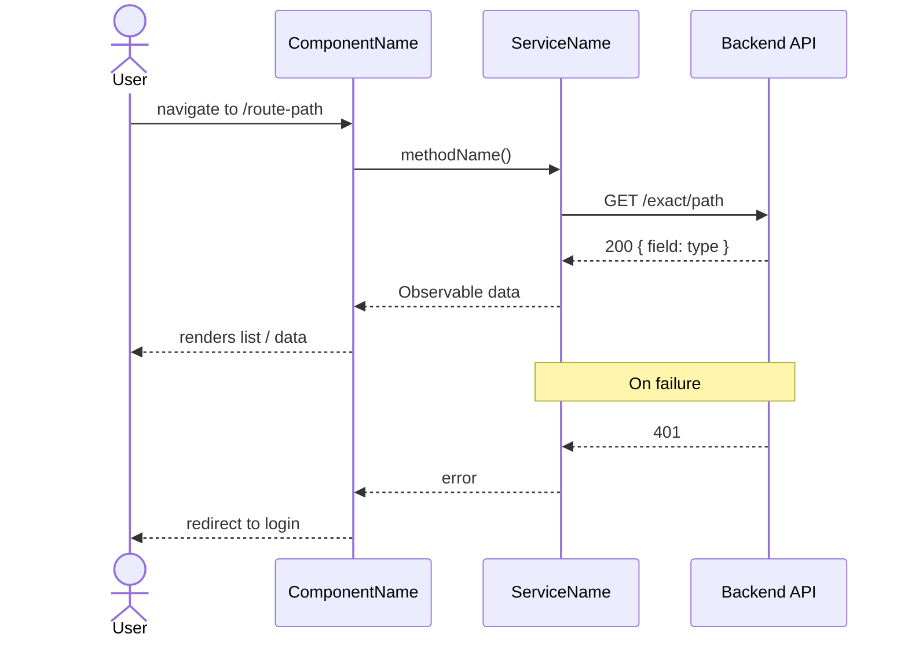
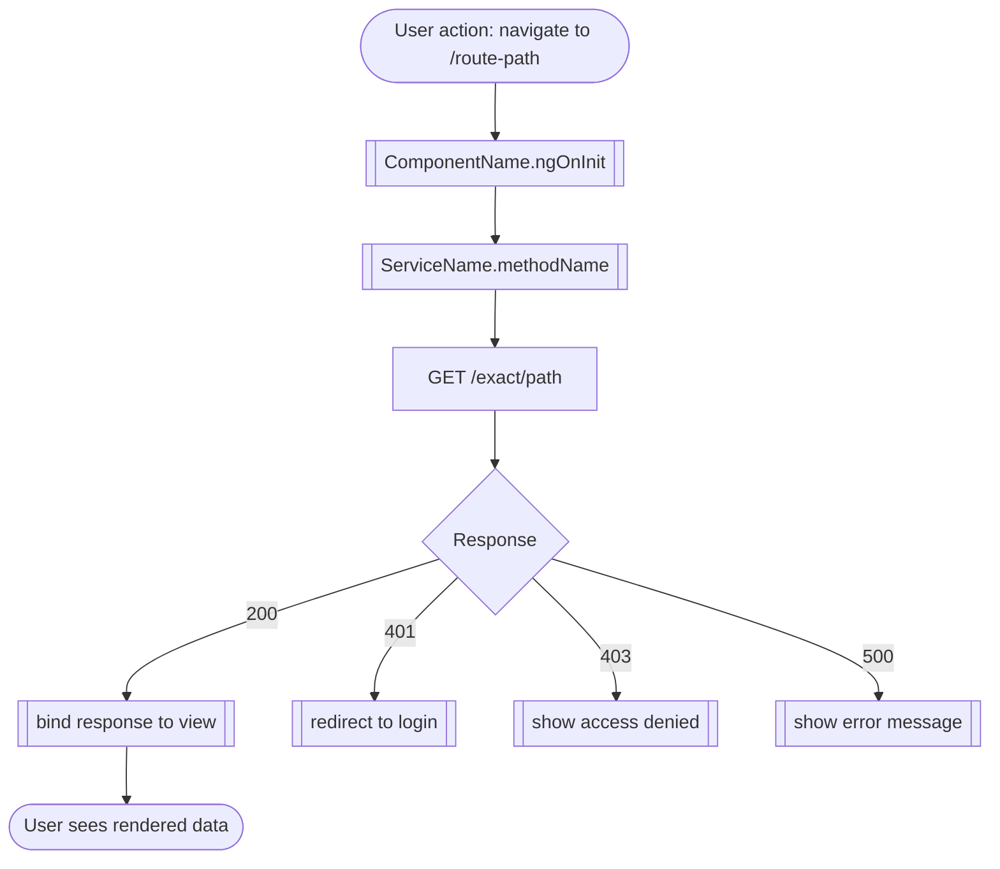
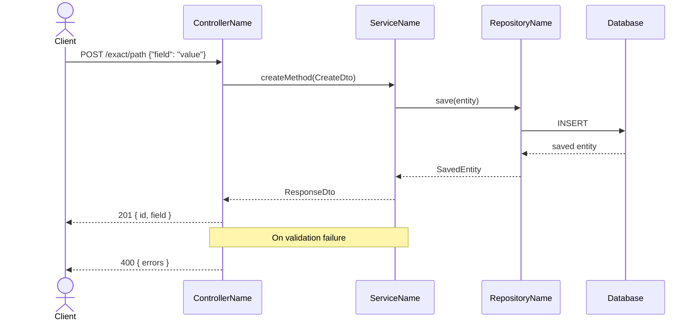
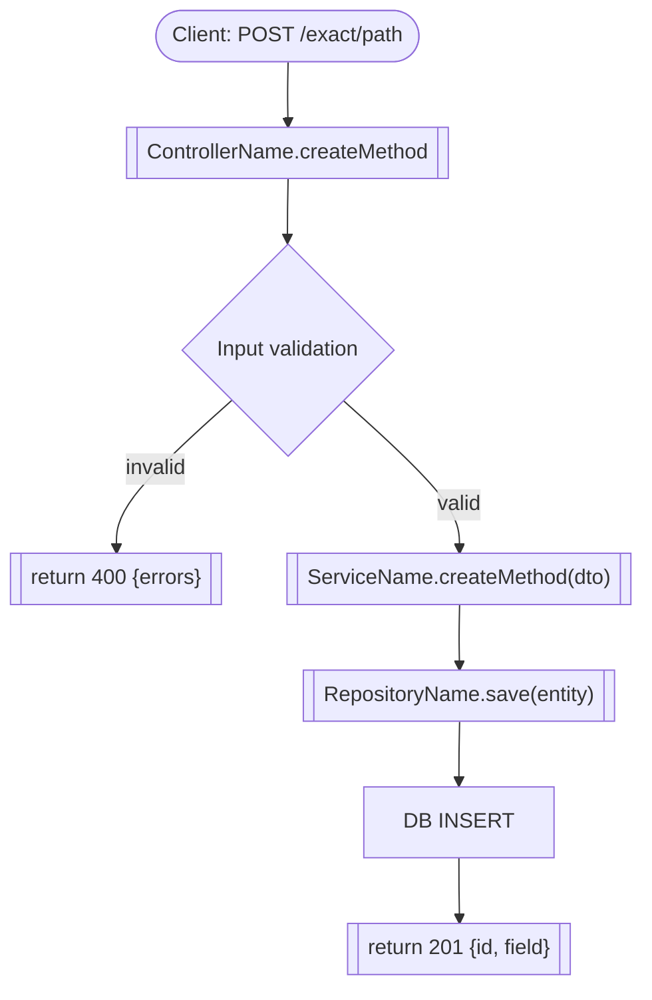
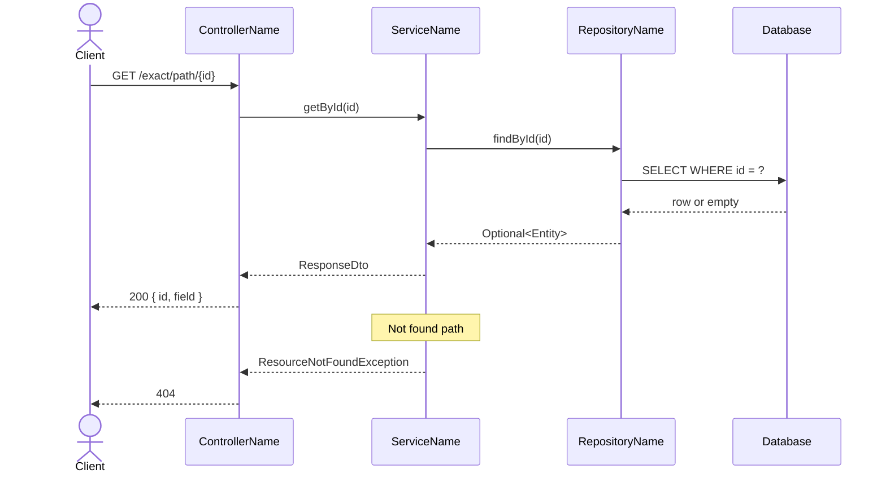
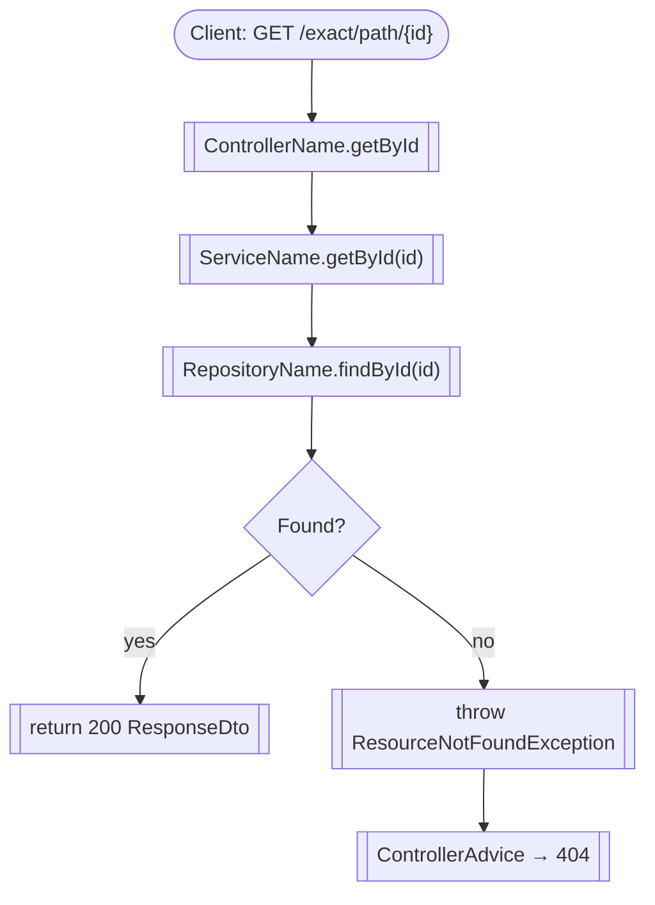
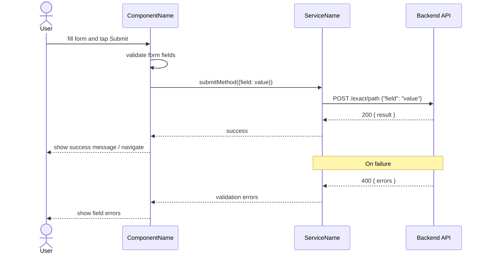
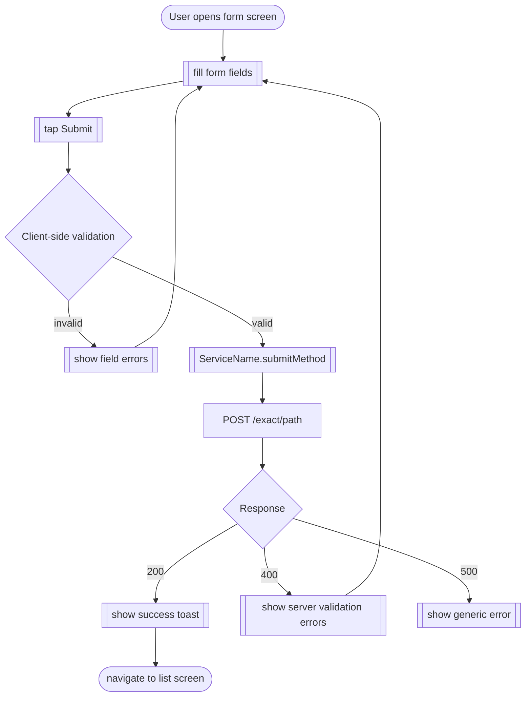

# FFL Output Template

Use this structure exactly. Replace every `[bracket token]` with the real value read from source. Never leave a bracket token in the final document.

---

````markdown
# Functional Flow Document — [Project Name]

**Generated:** [first-creation date — never changed on updates, e.g. 2026-06-01]
**Last updated:** [today's date — updated every run, e.g. 2026-06-09]
**Platforms:** [detected platforms, e.g. Angular 19 / Spring Boot 3.3]

---

## Changelog

| Date | Changes |
|------|---------|
| [today] | diff: +Feature; +GET /path; -POST /old; version A→B — or "Initial FFL document generated" |

---

## 1. Architecture Overview

### 1.1 System Architecture
[One paragraph describing how the detected platforms connect and communicate — e.g. "The Angular SPA makes REST calls to a Spring Boot API over HTTPS. The API handles business logic and persists data to a PostgreSQL database."]

### 1.2 [Platform] Architecture
**Pattern:** [MVVM / Clean Architecture / MVC / Layered / etc.]
**Layers:**
- `[layer name]` — [responsibility, e.g. "Presentation — Angular components and routing"]
- `[layer name]` — [responsibility]
- `[layer name]` — [responsibility]

**Key Directories:**
| Directory | Purpose |
|-----------|---------|
| `path/to/dir` | [what lives here] |
| `path/to/dir` | [what lives here] |

---

## 2. Functional Flows

> Each flow traces the full path from user action → component/controller → service method → API call → response handling.
> API endpoints must appear explicitly in both diagrams — not just in the endpoint table.

### 2.1 [Feature Name, e.g. Dashboard]

**Entry point:** `[route path, e.g. /dashboard]`
**Component:** `[ComponentName, read from routing file]`
**Guards:** `[canActivate guards if any, or "none"]`
**Screens involved:** [list of screen/component names involved]
**Endpoints called:**
- `GET /exact/path/from/code`
- `POST /exact/path/from/code`

#### Sequence Diagram



#### Flow



---

### 2.2 [Controller / Feature Name — split case example]

> Use this shape when a controller has endpoints with **materially different flows** (different service/repo/downstream, different auth). Give each endpoint its own `####` sub-section.

**Controller:** `[ControllerClassName]`
**Base path:** `[/base/path from class-level @RequestMapping or route file]`
**Guards:** `[guards or "none"]`

#### 2.2.1 POST /exact/path

**Endpoints called:** `POST /exact/path`

##### Sequence Diagram



##### Flow



---

#### 2.2.2 GET /exact/path/{id}

**Endpoints called:** `GET /exact/path/{id}`

##### Sequence Diagram



##### Flow



---

### 2.3 [Feature Name, e.g. Submit Form]

**Entry point:** `[route path]`
**Component:** `[ComponentName]`
**Guards:** `[guards or "none"]`
**Screens involved:** [list]
**Endpoints called:**
- `POST /exact/path/from/code`

#### Sequence Diagram



#### Flow



---

## 3. API Endpoint List

**Base URL:** `[exact value from committed environment.ts / application.yml — or the committed key/placeholder if externalized, e.g. ${API_BASE_URL} (externalized — value not committed)]`

### 3.1 [Domain, e.g. Dashboard]

| Method | Path | Called by | Request Body | Response Shape |
|--------|------|-----------|--------------|----------------|
| GET | `/exact/path` | `ServiceName.methodName()` | — | `{ field: type }` |
| POST | `/exact/path` | `ServiceName.methodName(body)` | `{ field: type }` | `{ field: type }` |

### 3.2 [Domain, e.g. Auth]

| Method | Path | Called by | Request Body | Response Shape |
|--------|------|-----------|--------------|----------------|
| POST | `/exact/path` | `ServiceName.login(creds)` | `{ username, password }` | `{ token: string }` |
````

---

## Notes on repeating sections

- Add one `### 2.x` section per **controller / routed feature** — never collapse multiple controllers into one section or one diagram. The count of `### 2.x` sections must equal the number of controllers/routed features found. If a controller's endpoints have materially different flows (different service/repo/downstream, different auth), split into `#### 2.x.y [METHOD /path]` sub-sections — each with its own Sequence + Flow pair (see the `### 2.2` split-case example above). If all endpoints share the same flow shape, one Sequence + Flow pair for the section is fine.
- Add one `### 3.x` subsection per **domain** (e.g. Auth, Dashboard, User Management, Reports).
- If there are multiple platforms (Angular + Spring Boot), add a `### 1.2 Angular Architecture` and `### 1.3 Spring Boot Architecture` under §1.
- The Spring Boot sequence and flow diagrams swap `UI as ComponentName` for `Client as HTTPClient` or `UI as [calling-service]` and add a `participant REPO as RepositoryName` between `SVC` and `API` if a repository layer is present.

## Notes on the Changelog

- **Newest row is always at the top** of the table, oldest at the bottom.
- `**Generated**` is written once (first creation) and never changed. `**Last updated**` is overwritten every run.
- On first creation, the Changelog contains exactly one row: `Initial FFL document generated`.
- On subsequent runs, one new row is prepended. All prior rows are preserved unchanged.
- Diff notation: `+` added, `-` removed, `~` changed (body/response shape), `version A→B` for a version bump. If nothing changed: `No functional changes (re-verified)`.
- The Changelog tracks §2 flow names and §3 endpoint method+path pairs. It does not track Architecture section edits.
- **Current truth lives in §2–§3** (always regenerated from source). The Changelog records *that* something changed, not the old value. To see what an endpoint currently does, read §2/§3; to see when it changed, read the Changelog.
