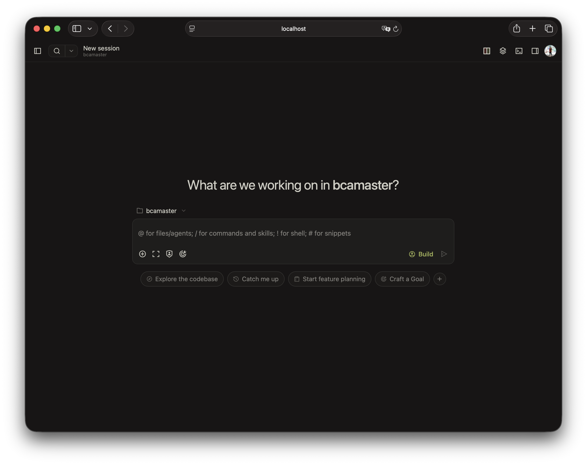

Mage dapat dijalankan sebagai web application tanpa meninggalkan workflow terminal.



## Mulai

```bash
mage web
```

Mage memilih port yang tersedia di `127.0.0.1` lalu membuka browser secara otomatis.

:::caution
Server tidak aman bila `MAGE_SERVER_PASSWORD` belum diatur. Kondisi ini sesuai untuk akses lokal, tetapi jangan expose server ke network tanpa autentikasi.
:::

## Konfigurasi server

Tentukan port dan hostname melalui CLI.

```bash
mage web --port 4096 --hostname 0.0.0.0
```

`127.0.0.1` hanya dapat diakses dari mesin lokal. `0.0.0.0` membuka akses melalui network interface yang tersedia.

Aktifkan mDNS untuk mengiklankan server sebagai `mage.local` di local network.

```bash
mage web --mdns
mage web --mdns --mdns-domain project-saya.local
```

Tambahkan origin CORS untuk custom frontend bila diperlukan.

```bash
mage web --cors https://example.com
```

### Autentikasi

Atur Basic Auth sebelum membuka akses network.

```bash
MAGE_SERVER_USERNAME=mage MAGE_SERVER_PASSWORD=rahasia mage web --hostname 0.0.0.0
```

Username default adalah `mage`.

{/* 
## Menggunakan Web

Homepage menampilkan sesi aktif dan menyediakan entry point untuk membuat sesi baru.


Pilih **See Servers** untuk memeriksa server yang terhubung beserta statusnya.


## Menghubungkan TUI

TUI dan Web dapat memakai server serta state yang sama.

```bash
# Terminal pertama
mage web --port 4096

# Terminal kedua
mage attach http://localhost:4096
```

## Config file

Server juga dapat dikonfigurasi di `~/.mage/mage.json`. CLI flag mengambil prioritas atas config file.

```json title="~/.mage/mage.json"
{
  "server": {
    "port": 4096,
    "hostname": "0.0.0.0",
    "mdns": true,
    "cors": ["https://example.com"]
  }
}
```

*/}